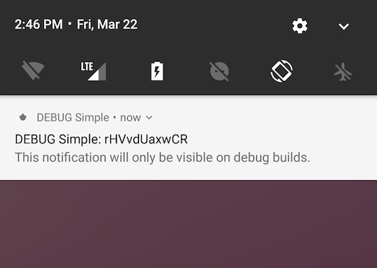

# Quirks That You Should Probably Be Aware Of

### lazythreetenbp for backported Java 8 date-time API

Simple uses [lazythreetenbp](https://github.com/gabrielittner/lazythreetenbp) for working with date and time. Due to some limitations, the IDE does not understand how to download its sources. As a work around, the sources can be downloaded from [the maven repository](http://search.maven.org/#search%7Cga%7C1%7Cthreetenbp) and manually attached to Android Studio.

### Syncing of data using WorkManager

[WorkManager](https://developer.android.com/topic/libraries/architecture/workmanager) is used for scheduling periodic syncing of patient-related data like blood pressures, prescribed medicines, and demographic information. For debugging the state of the jobs, use this command:

```
adb shell dumpsys jobscheduler | grep org.simple.clinic
```

### Android tests

When compiling the project using Android Studio's `Make Project` option, it may not build files or run annotation processors inside the `androidTest` package. This can cause confusion when changes are made to Android tests. As a workaround, `androidTest` can be compiled from the command line manually,

```
./gradlew assembleAndroidTest
```

### Verifying a new user account with SMS code

During development, the QA server environment defaults to using `000000` as the SMS verification code for logging in to the app. The app also tries to auto-read the OTP if an SMS is received in the format,

```
<#> 000000 is your Simple Verification Code
{app signature}
``` 

The app signature can be found in the debug notification's title:


